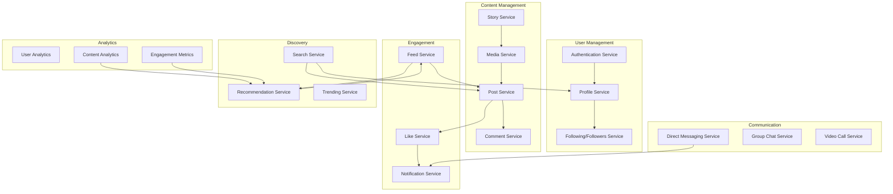

# nest-micro-social

NestJS Micro Social Media

I'll outline key microservices that social media platforms like Facebook and Instagram typically implement.

Let me break down each major service category and its components:

1. User Management Services:

   - Authentication Service: Handles user registration, login, JWT tokens, OAuth
   - Profile Service: Manages user profiles, settings, privacy controls
   - Following/Followers Service: Manages social connections and relationships

2. Content Management Services:

   - Post Service: Handles creation, editing, deletion of posts
   - Media Service: Manages photos, videos, image processing, filters
   - Story Service: Handles temporary content like stories
   - Comment Service: Manages comments and replies

3. Engagement Services:

   - Like Service: Handles reactions and favorites
   - Notification Service: Manages push notifications, in-app alerts
   - Feed Service: Aggregates and delivers personalized content feeds

4. Analytics Services: (X)

   - User Analytics: Tracks user behavior and engagement
   - Content Analytics: Measures content performance
   - Engagement Metrics: Tracks interactions and reach

5. Communication Services:

   - Direct Messaging Service: Handles private messages
   - Group Chat Service: Manages group conversations
   - Video Call Service: Handles video/audio calls

6. Discovery Services:
   - Search Service: Handles user and content search
   - Recommendation Service: Suggests content and connections
   - Trending Service: Identifies and promotes viral content (X)

Each of these services would typically:

- Have its own database
- Communicate via message queues (like RabbitMQ or Kafka)
- Implement caching (Redis/Memcached)
- Have separate scaling policies
- Include monitoring and logging

Would you like me to dive deeper into any particular service's implementation details or explain how specific features work together?
